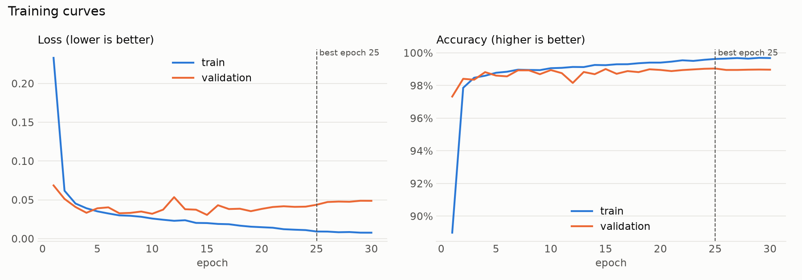
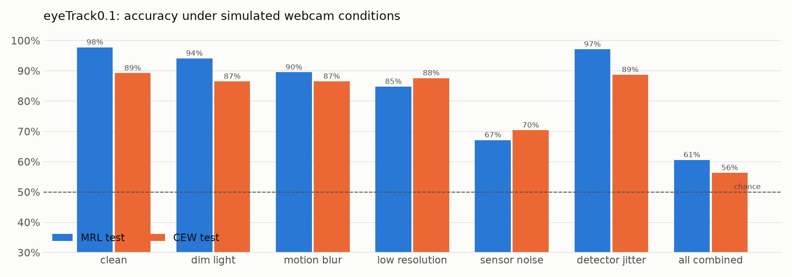
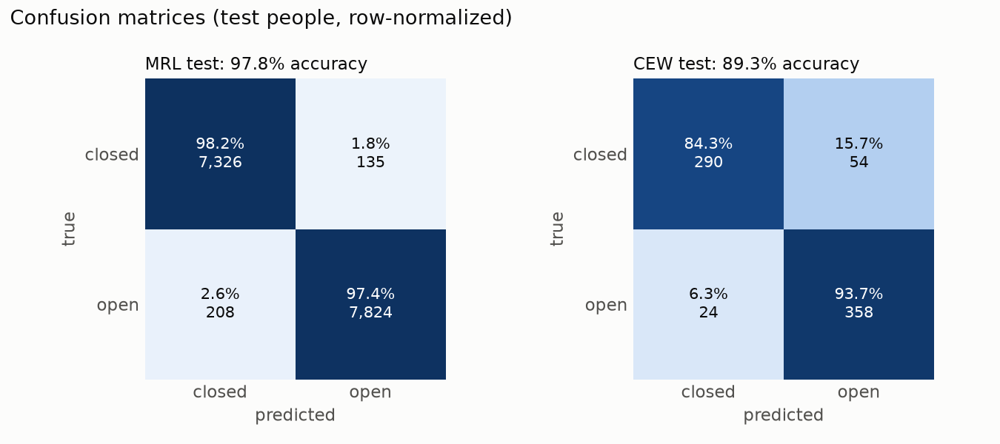
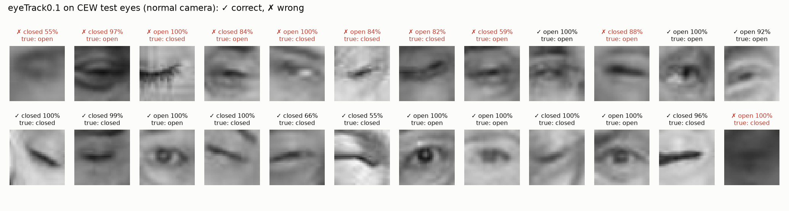

# Step 7: train eyeTrack0.1

> This branch is one step of **[eyeTracker](https://github.com/tegemenozyurek/eyeTracker)**, a real-time driver
> monitoring system that runs in the browser. Every step of the project has its own branch, and its README explains
> what was done in that step. The project overview is the README on [`main`](https://github.com/tegemenozyurek/eyeTracker).
>
> Previous: [Step 6: define the CNN](https://github.com/tegemenozyurek/eyeTracker/tree/step-06-define-cnn) ·
> Next: [Step 8: web demo with the rules baseline](https://github.com/tegemenozyurek/eyeTracker/tree/step-08-web-demo-rules)

## What was done

- **[`scripts/train.py`](scripts/train.py)** trains the eye CNN on the 32x32 crops from Step 5, logging every step and
  epoch to the [training monitor](https://github.com/tegemenozyurek/eyeTracker/tree/step-02-training-monitor) (curves,
  confusion matrix, sample predictions, Stop button). AdamW, one warm-up epoch, cosine learning-rate decay; the epoch
  with the best validation accuracy is kept.
- **`eyeTrack0.1`**: trained on the infrared eyes of the 25 MRL training people only, no augmentation: the baseline.
- **[`scripts/evaluate.py`](scripts/evaluate.py)** tests on people the model has never seen: MRL test (infrared),
  CEW test (normal camera), both under a **simulated webcam** ([`src/webcam.py`](src/webcam.py): dim light, motion blur,
  low resolution, sensor noise, detector jitter, alone and combined), and MRL per camera, lighting, glasses and
  reflections.

## Why

`eyeTrack0.1` shows what a model trained only on infrared eyes can and cannot do. Its drop on normal-camera and
webcam-like eyes is the problem `eyeTrack0.5` has to solve.

## Results

From `python scripts/train.py --name eyeTrack0.1` and `python scripts/evaluate.py --model eyeTrack0.1`
([full report](models/eyeTrack0.1/test_report.txt)):

| | |
|---|---|
| training | 30 epochs, 7.8 min on the M4 GPU (MPS); best validation accuracy 99.0% at epoch 25 |
| **MRL test** (7 unseen people, infrared) | **97.8%** accuracy, macro F1 97.8% |
| **CEW test** (normal camera) | **89.3%** accuracy, macro F1 89.2%; closed eyes caught 84.3% |
| simulated webcam, all effects combined | **60.6%** MRL, **56.3%** CEW (guessing = 50%) |



Validation accuracy levels off at about 99.0% while validation loss rises from 0.0320 (epoch 10) to 0.0487 (epoch 30):
**mild overfitting**. The model grows more confident on its training eyes without getting more correct on new people.



**The domain gap:** sensor noise alone drops MRL from 97.8% to 67.2%, and all effects together leave the model close to
guessing. Excellent on infrared eyes, nearly useless on a webcam.




**No camera shortcut.** Step 4 found that eye state is tied to the camera in MRL. Accuracy alone could hide a model that
just says "open" on mostly-open cameras, so the report also counts the closed eyes caught: 98.2% (RealSense),
98.5% (IDS, 130 closed eyes) and 100% (Aptina, a camera it never trained on, 73 closed eyes). Small samples for the
last two, but no sign of cheating.

## Try it

```bash
git checkout step-07-train-eyetrack01
python tools/monitor/app.py                          # watch it live (optional)
python scripts/train.py --name eyeTrack0.1           # about 8 minutes on an M4
python scripts/evaluate.py --model eyeTrack0.1
```

The trained weights are included: `models/eyeTrack0.1/model.pt` (1.2 MB).
