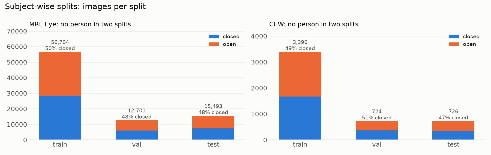
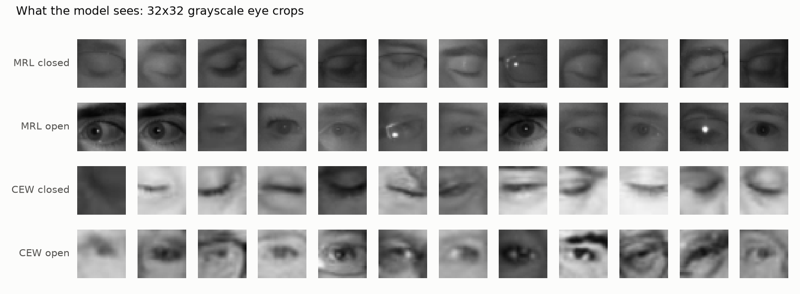

# Step 5: eye crops and subject-wise splits

> This branch is one step of **[eyeTracker](https://github.com/tegemenozyurek/eyeTracker)**, a real-time driver
> monitoring system that runs in the browser. Every step of the project has its own branch, and its README explains
> what was done in that step. The project overview is the README on [`main`](https://github.com/tegemenozyurek/eyeTracker).
>
> Previous: [Step 4: explore the data](https://github.com/tegemenozyurek/eyeTracker/tree/step-04-explore-data) ·
> Next: Step 6: define the CNN

## What was done

[`scripts/preprocess.py`](scripts/preprocess.py) turns every eye from MRL Eye and CEW into the exact input the model
will get, and splits the data so that **no person appears in two splits**.

- **Crops:** every eye becomes a 32x32 grayscale image. Large MRL crops are shrunk by averaging blocks of pixels (the
  way the live demo will shrink webcam eyes); CEW's 24 px patches are enlarged.
- **MRL split by person:** a seeded search over 20,000 random person-to-split assignments keeps the one closest to
  70 / 15 / 15% of the images, with a similar share of closed eyes in every split, every camera present in the test
  set, and at least 10 / 5 / 7 people per split.
- **CEW split by group:** closed eyes are grouped by the photo they were cut from (left and right eye of one face stay
  together), open eyes by the person's name.
- Output: `data/processed/eyes32.npz` (git-ignored) with the crops, labels, split, group and MRL recording conditions
  (camera, lighting, glasses, reflections) for later per-condition evaluation.

## Why

A model tested on people it has already seen can pass by recognizing faces it memorized; Step 4 showed that MRL
people differ wildly in how often their eyes are closed (2% to 100%). Only a split by person measures what matters
in a car: how the model does on a **new driver**.

## Results

From `python scripts/preprocess.py`:

| | split | images | share | closed | people / groups |
|---|---|---:|---:|---:|---:|
| MRL | train | 56,704 | 66.8% | 50.0% | 25 |
| MRL | val | 12,701 | 15.0% | 48.1% | 5 |
| MRL | test | 15,493 | 18.2% | 48.2% | 7 |
| CEW | train | 3,396 | 70.1% | 49.2% | 1,656 |
| CEW | val | 724 | 14.9% | 50.8% | 355 |
| CEW | test | 726 | 15.0% | 47.4% | 354 |

- People or groups in more than one split: **0** (checked by the script, which refuses to save otherwise).
- MRL test people: 7, 12, 16, 28, 29, 30, 34.
- The Aptina camera belongs to only two people, who are in validation and test: the model never trains on it, which
  gives a built-in test on a camera it has never seen.




**Caught and fixed:** a file-name pattern silently skipped 140 CEW eyes (photos saved as `.BMP`, `.JPG` or `.png`),
and the first split put only 3 people in the test set, so the test would have judged 3 individuals.

**Still open:** CEW has no face photos, so the live eye crop cannot be checked against CEW's exact framing yet. Step 9
fits the live crop to these 32x32 crops, and training augmentation covers small framing differences.

## Try it

```bash
git checkout step-05-eye-crops-splits
python scripts/preprocess.py     # about 10 seconds; needs data/mrl and data/cew from Step 3
```
