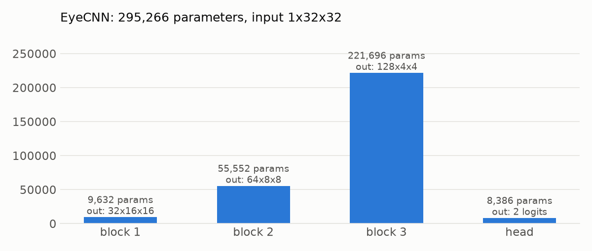

# Step 6: define the CNN

> This branch is one step of **[eyeTracker](https://github.com/tegemenozyurek/eyeTracker)**, a real-time driver
> monitoring system that runs in the browser. Every step of the project has its own branch, and its README explains
> what was done in that step. The project overview is the README on [`main`](https://github.com/tegemenozyurek/eyeTracker).
>
> Previous: [Step 5: eye crops and subject-wise splits](https://github.com/tegemenozyurek/eyeTracker/tree/step-05-eye-crops-splits) ·
> Next: [Step 7: train eyeTrack0.1](https://github.com/tegemenozyurek/eyeTracker/tree/step-07-train-eyetrack01)

## What was done

- **[`src/model.py`](src/model.py): `EyeCNN`**, the network shared by `eyeTrack0.1` and `eyeTrack0.5`. Three
  convolutional blocks (conv 3x3 → BatchNorm → ReLU, twice, then max-pooling and dropout) turn a 32x32 grayscale eye
  into 128 feature maps of 4x4, then average pooling and a small classifier give two scores: closed and open.

  ```
  1x32x32 → 32x16x16 → 64x8x8 → 128x4x4 → average → 64 → 2 logits
  ```

- **[`scripts/model_summary.py`](scripts/model_summary.py)** prints a layer-by-layer summary, runs the untrained
  network on real eyes to check the wiring, and times it.

## Why

The model has to run on both eyes of every webcam frame, in the browser, next to MediaPipe's face landmarker, so it
is kept small. Checking shapes and speed before training catches wiring mistakes cheaply.

## Results

From `python scripts/model_summary.py`:

| | |
|---|---|
| parameters | 295,266 (1.18 MB as float32) |
| both eyes (batch 2), CPU | 0.75 ms |
| both eyes (batch 2), Apple GPU (MPS) | 0.52 ms |
| 256 eyes, MPS | 13.80 ms (54 µs per eye) |
| untrained output | "open" at 53.2% for every eye: chance level, as expected before training |



Most parameters sit in the last block (221,696), where 128 filters each look at 128 input channels.

## Try it

```bash
git checkout step-06-define-cnn
python scripts/model_summary.py     # needs data/processed/eyes32.npz from Step 5
```
