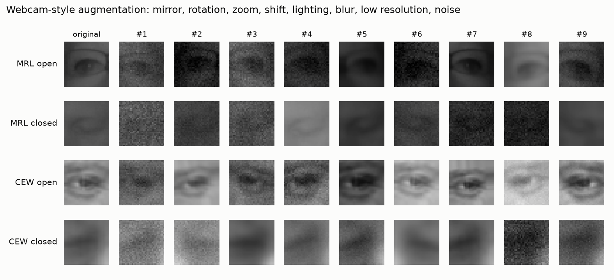
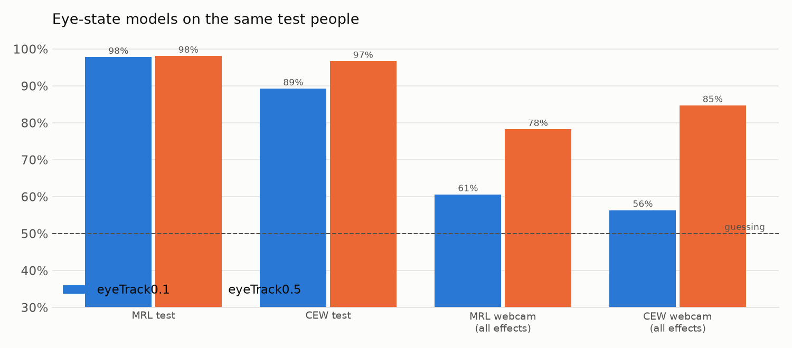
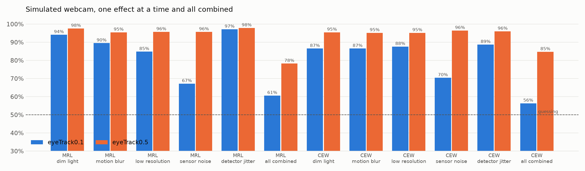

# Step 10: train eyeTrack0.5

> This branch is one step of **[eyeTracker](https://github.com/tegemenozyurek/eyeTracker)**, a real-time driver
> monitoring system that runs in the browser. Every step of the project has its own branch, and its README explains
> what was done in that step. The project overview is the README on [`main`](https://github.com/tegemenozyurek/eyeTracker).
>
> Previous: [Step 9: one eye-crop function in Python and JavaScript](https://github.com/tegemenozyurek/eyeTracker/tree/step-09-eye-crop-parity) ·
> Next: Step 11: export to ONNX and plug into the demo

## What was done

- **`eyeTrack0.5`**: the same 295,266-parameter CNN as `eyeTrack0.1`, trained on MRL (infrared) **and** CEW (normal
  camera). CEW is only 6% of the training eyes, so it is drawn with replacement to fill 30% of every epoch
  (`--cew-share 0.3`); the best epoch is chosen by the mean of the MRL and CEW validation accuracies, so both count.
- **Webcam-style augmentation** ([`src/augment.py`](src/augment.py)): every training eye is randomly mirrored, rotated,
  zoomed (also out, because MRL crops are framed tighter than ours), shifted, darkened or brightened, blurred (focus or
  motion), lowered in resolution and given sensor noise.
- **[`scripts/compare_eye_models.py`](scripts/compare_eye_models.py)** puts both models through exactly the same test
  eyes and simulated webcam conditions.



A first version of the augmentation was too harsh: many dark infrared eyes became black noise that no person could
label. It was toned down (gamma up to 1.6, noise up to σ = 0.05) before training.

## Why

`eyeTrack0.1` was excellent on infrared eyes and close to guessing on a simulated webcam (Step 7). The live demo uses a
webcam, so this domain gap is the problem to solve.

## Results

From `python scripts/compare_eye_models.py eyeTrack0.1 eyeTrack0.5` ([table](models/eye_models_comparison.txt)):

| test (same people for both) | `eyeTrack0.1` | `eyeTrack0.5` |
|---|---:|---:|
| MRL test (infrared) | 97.8% | **98.1%** |
| CEW test (normal camera) | 89.3% | **96.7%** |
| simulated webcam, all effects, MRL | 60.6% | **78.2%** |
| simulated webcam, all effects, CEW | 56.3% | **84.7%** |
| sensor noise only, MRL | 67.2% | **95.7%** |
| closed eyes caught, MRL clean | **98.2%** | 96.9% |
| training time (M4, MPS) | 7.8 min | 8.2 min |




- Every single webcam effect now stays at 95% or more on both test sets.
- **The price:** on clean MRL eyes it catches slightly fewer closed eyes (98.2% → 96.9%).
- **No overfitting:** training accuracy is now below validation accuracy, because training sees the degraded eyes;
  validation loss stays flat around 0.03 ([curves](assets/eyeTrack0.5/training_curves.png)).
- **Caveat:** the augmentation and the simulated-webcam test use the same kinds of effects, so `eyeTrack0.5` was
  prepared for this test by design. The real judge is the live webcam (Step 11).

## Try it

```bash
git checkout step-10-train-eyetrack05
python scripts/preview_augmentation.py
python scripts/train.py --name eyeTrack0.5 --sources mrl,cew --augment webcam --cew-share 0.3   # about 8 minutes
python scripts/evaluate.py --model eyeTrack0.5
python scripts/compare_eye_models.py eyeTrack0.1 eyeTrack0.5
```

Weights included: `models/eyeTrack0.5/model.pt` (1.2 MB).
