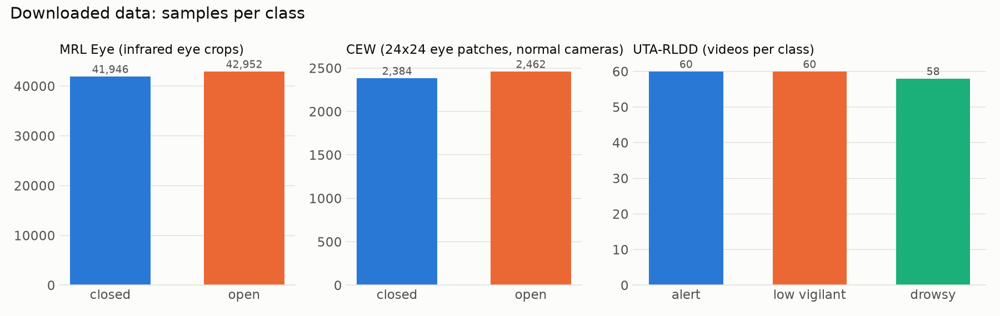

# Step 3: download the data

> This branch is one step of **[eyeTracker](https://github.com/tegemenozyurek/eyeTracker)**, a real-time driver
> monitoring system that runs in the browser. Every step of the project has its own branch, and its README explains
> what was done in that step. The project overview is the README on [`main`](https://github.com/tegemenozyurek/eyeTracker).
>
> Previous: [Step 2: training monitor](https://github.com/tegemenozyurek/eyeTracker/tree/step-02-training-monitor) ·
> Next: Step 4: explore the data

## What was done

- **[`scripts/download_data.py`](scripts/download_data.py)** streams three datasets straight from the Kaggle API into
  `data/` (git-ignored), with byte progress visible in the [training monitor](https://github.com/tegemenozyurek/eyeTracker/tree/step-02-training-monitor).
  The zips are unpacked and deleted, nothing stays in hidden caches, and each dataset is checked after download.
- **[`scripts/clean_data.py`](scripts/clean_data.py)** lists how much disk each dataset uses and deletes the ones you
  name, after asking. Datasets can be downloaded again with one command, so they can be deleted once the models are
  trained.
- **UTA-RLDD without the 111 GB of video.** Instead of a subset of the original videos, we use a public version that
  already contains MediaPipe face features per frame (1.33 GB, no images). This required two changes to the plan,
  recorded in [`BRIEF.md`](BRIEF.md).

| dataset | used by | source (Kaggle) | what it is |
|---|---|---|---|
| MRL Eye | `eyeTrack0.1`, `eyeTrack0.5` | `imadeddinedjerarda/mrl-eye-dataset` | infrared eye crops, open / closed, original MRL file names (person ID, glasses, lighting, sensor) |
| CEW | `eyeTrack0.5` | `faisal7/cew-dataset` | the official 24x24 eye patches of Closed Eyes In The Wild, from normal-camera photos |
| UTA-RLDD features | `eyeTrack1` | `abdulrahmankhengari/uta-rldd-face-features` | MediaPipe blendshapes, eye/mouth openness, head pose and landmarks per frame at 10 fps; official 5-fold split |

## Why

`eyeTrack0.1` learns open / closed eyes from infrared images (MRL), `eyeTrack0.5` adds eyes from normal cameras (CEW)
to close the gap to a webcam, and `eyeTrack1` learns real drowsiness over time from UTA-RLDD. The RLDD version was
chosen because it fits on this laptop, needs no hours of video processing, uses the same MediaPipe face landmarker as
the browser demo, and contains no faces, so the rule "never show an RLDD face" holds by construction.

## Results

From `python scripts/download_data.py`:

| | |
|---|---|
| MRL Eye | 84,898 images from 37 people: 41,946 closed, 42,952 open. Eye state in the file name matches the folder for all 84,898. 382 to 10,257 images per person; 28.3% with glasses |
| CEW | 4,846 eye patches: 2,384 closed, 2,462 open |
| UTA-RLDD features | 178 videos from 60 people (alert 60, low vigilant 60, drowsy 58), 1,115,058 frames, 283 columns per frame (52 blendshapes). 168 of 178 videos pass the dataset's own quality check |
| disk | 1.76 GB in total (MRL 328 MB, CEW 2 MB, RLDD 1,428 MB) instead of 111 GB |



**Trade-offs, stated honestly:**
- No Kaggle copy of CEW contains the face photos of both classes, only the 24x24 eye patches. Step 5 decides how to
  align these patches with the eye crops cut from the live webcam.
- The RLDD features were extracted by a third party, not by the dataset's authors; they are credited next to the
  original paper. Because there are no images, `eyeTrack1` uses MediaPipe's eye-blink scores instead of
  `eyeTrack0.5`'s eye-closure probability.

## Try it

```bash
git checkout step-03-download-data
python scripts/download_data.py     # ~10 minutes, 1.76 GB; needs a Kaggle token in ~/.kaggle/access_token
python scripts/clean_data.py        # how much disk each dataset uses
```

## Data credits

- **MRL Eye Dataset:** Media Research Lab, VŠB – Technical University of Ostrava.
- **CEW:** Song, Tan, Liu, Chen, *Eyes Closeness Detection from Still Images with Multi-scale Histograms of Principal
  Oriented Gradients*, Pattern Recognition 2014.
- **UTA-RLDD:** Ghoddoosian, Galib, Athitsos, *A Realistic Dataset and Baseline Temporal Model for Early Drowsiness
  Detection*, CVPR Workshops 2019 (arXiv:1904.07312). Features: *UTA-RLDD Face Features* (Kaggle, CC BY 4.0).
