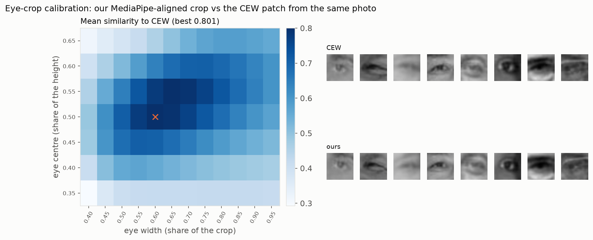
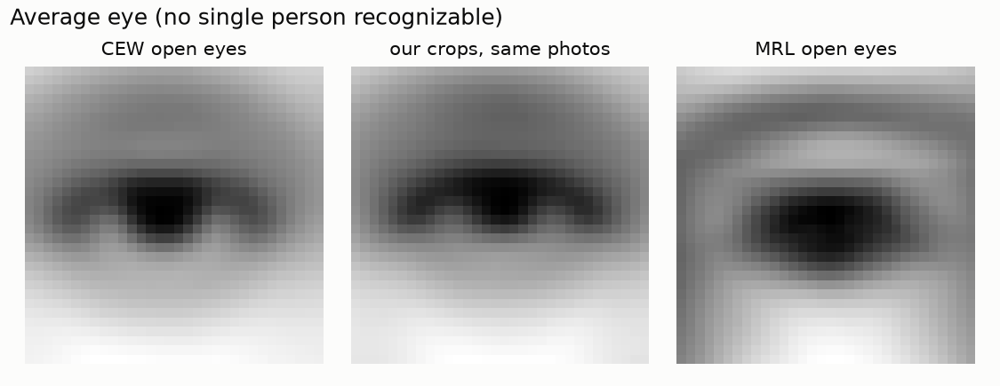

# Step 9: one eye-crop function in Python and JavaScript

> This branch is one step of **[eyeTracker](https://github.com/tegemenozyurek/eyeTracker)**, a real-time driver
> monitoring system that runs in the browser. Every step of the project has its own branch, and its README explains
> what was done in that step. The project overview is the README on [`main`](https://github.com/tegemenozyurek/eyeTracker).
>
> Previous: [Step 8: web demo with the rules baseline](https://github.com/tegemenozyurek/eyeTracker/tree/step-08-web-demo-rules) ·
> Next: Step 10: train eyeTrack0.5

## What was done

- **One crop, written twice:** [`src/eyecrop.py`](src/eyecrop.py) (training) and [`web/eyecrop.js`](web/eyecrop.js)
  (browser) are line-by-line copies. The two corners of an eye (MediaPipe landmarks 33/133 and 362/263) are mapped by
  a similarity transform (rotation, scale, shift) onto fixed points of a 32x32 crop, so every eye arrives level and
  the same size. Pixels are sampled by hand (bilinear, 4x4 points averaged per output pixel) instead of OpenCV or the
  canvas, which resample differently.
- **Parity test:** [`scripts/eye_crop_parity.py`](scripts/eye_crop_parity.py) writes 24 cases (a smooth and a noise
  image, eyes level, tilted up to 40°, 8 px and 90 px wide, half outside the image) with Python's crops;
  [`web/eyecrop.test.mjs`](web/eyecrop.test.mjs) runs the JavaScript on them, also through the small pixel box the
  browser actually reads.
- **Calibration:** [`scripts/calibrate_eye_crop.py`](scripts/calibrate_eye_crop.py) measures how large and where the eye
  should be in the crop. CEW's open eyes were cut from LFW photos; MediaPipe runs on 600 of those photos, and 84
  framings are compared with the CEW patches. The winner is saved in [`models/eye_crop.json`](models/eye_crop.json).
- **Real-face check:** [`scripts/eye_crop_realface.py`](scripts/eye_crop_realface.py) +
  [`tools/eyecrop_check.html`](tools/eyecrop_check.html) run the whole pipeline (MediaPipe + crop) in Python and in the
  browser on 20 LFW faces.
- **The demo's "Model input" view** now shows exactly the aligned crop a model receives.

## Why

A model only works live if the eyes it sees in the browser look like the eyes it was trained on. If training and the
browser cut eyes even slightly differently, accuracy measured in Python would promise more than the demo delivers.

## Results

| check | result |
|---|---|
| parity, full image | 24 of 24 crops match; largest difference 5.00e-7 gray levels |
| parity, browser's pixel box | 24 of 24 match; largest difference 5.00e-7 |
| calibration (600 CEW eyes) | best framing: eye width 0.60 of the crop, centre at 0.50; mean similarity 0.801 (first guess 0.70: 0.763). CEW's "L" patches are MediaPipe's left eye in 561 of 600 |
| real faces (40 eyes, 20 LFW faces) | eye corners from browser and Python MediaPipe < 0.005 px apart; crops differ by 0.120 gray levels on average (largest pixel 0.63 of 255), only from JPEG decoding; similarity 1.000 |




Our crops of the LFW photos look like the CEW patches on average. The average MRL eye is framed tighter, one more
reason why `eyeTrack0.5` trains with random zoom and shift.

## Try it

```bash
git checkout step-09-eye-crop-parity
node web/eyecrop.test.mjs                      # the parity test
python scripts/download_data.py lfw            # 118 MB, for the calibration only
python scripts/calibrate_eye_crop.py           # about 75 s
python scripts/eye_crop_realface.py && python -m http.server 8020
# then open http://localhost:8020/tools/eyecrop_check.html
```
