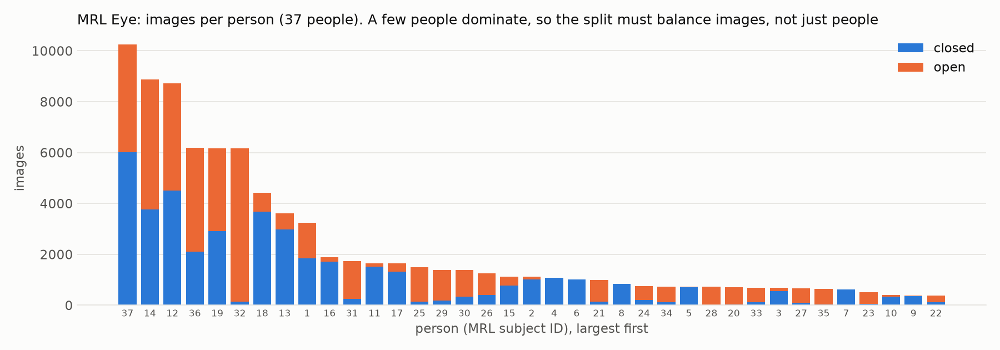
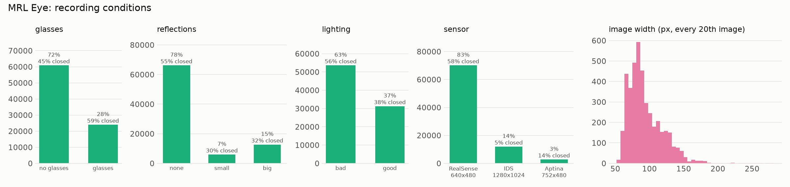
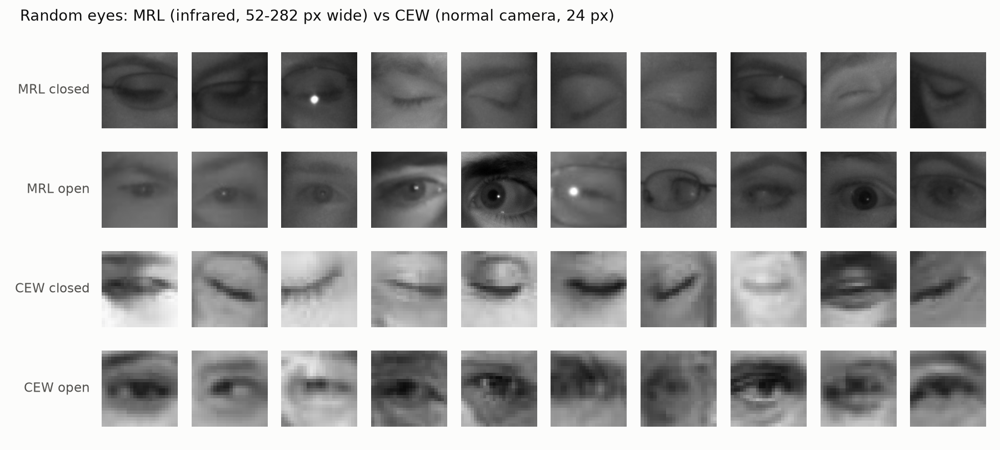
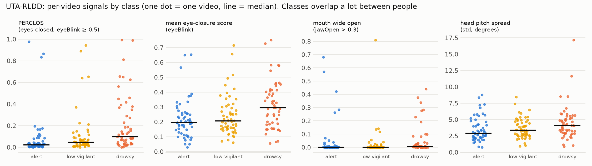
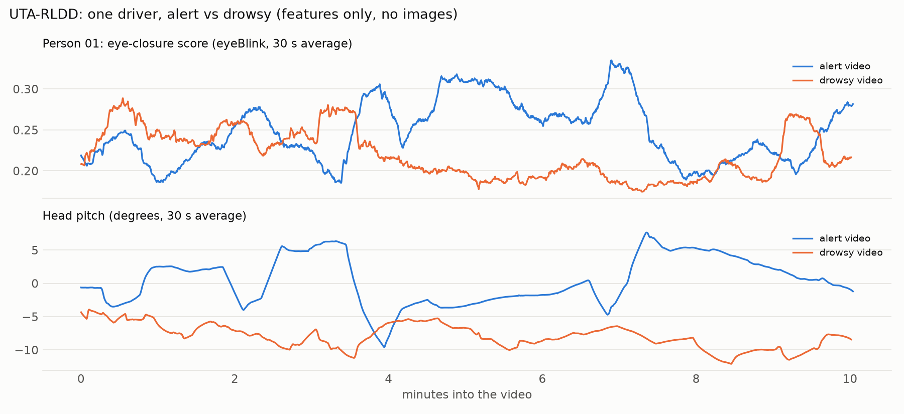
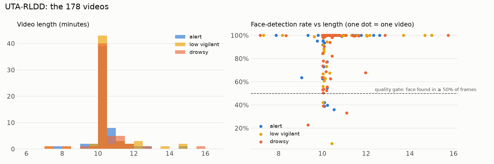

# Step 4: explore the data

> This branch is one step of **[eyeTracker](https://github.com/tegemenozyurek/eyeTracker)**, a real-time driver
> monitoring system that runs in the browser. Every step of the project has its own branch, and its README explains
> what was done in that step. The project overview is the README on [`main`](https://github.com/tegemenozyurek/eyeTracker).
>
> Previous: [Step 3: download the data](https://github.com/tegemenozyurek/eyeTracker/tree/step-03-download-data) ·
> Next: Step 5: eye crops and subject-wise splits

## What was done

[`scripts/explore_data.py`](scripts/explore_data.py) looks at all three datasets before any model is built on them
and saves six charts in [`assets/explore/`](assets/explore/). UTA-RLDD is shown as numbers and curves only: the
version used here contains no images.

## Why

Before training, the data has to be understood: who is in it, how it was recorded, and whether the signal we want to
learn is actually there. Problems found now (a few people dominating, shortcuts a model could cheat with, a weak
signal) decide how Steps 5 to 13 are built.

## Results

All numbers from `python scripts/explore_data.py`.

### MRL Eye: a few people dominate



- 84,898 images from 37 people. The three largest people contribute **32.8%** of all images; the smallest person has
  382 images, the median 1,114, the largest 10,257.
- The share of closed eyes per person ranges from **2% to 100%** (median 47%). If one person were in both training and
  test, a model could recognize the person and guess their usual eye state. The split in Step 5 must keep people
  apart and still balance images and classes.

### MRL Eye: shortcuts a model could learn



| condition | share of images | closed eyes within it |
|---|---:|---:|
| RealSense camera | 82.6% | 58.4% |
| IDS camera | 14.1% | **4.8%** |
| Aptina camera | 3.3% | 13.6% |
| bad lighting | 63.2% | 55.8% |
| good lighting | 36.8% | 38.5% |
| glasses | 28.3% | 59.4% |

Eye state is tied to the camera and the lighting. A model could learn "this camera's picture means open" instead of
looking at the eyelid, so the evaluation will also report accuracy per condition. Image width ranges from 52 to 282
px (median 87); CEW patches are 24 px.

### Infrared (MRL) vs normal camera (CEW)



The two datasets look clearly different: MRL is sharp infrared with bright reflections, CEW is small, blurry and
lit by ordinary light, much closer to a webcam. This is the domain gap `eyeTrack0.5` is meant to close.

### UTA-RLDD: the signal is real, but weak across people



| per video (168 videos that pass quality control) | alert | low vigilant | drowsy |
|---|---:|---:|---:|
| median PERCLOS (share of frames with eyes closed) | 2.2% | 4.7% | 9.8% |
| median eye-closure score (eyeBlink) | 0.195 | 0.206 | 0.295 |
| median head-pitch spread (degrees) | 2.907 | 3.371 | 4.100 |

- Within the same person, the drowsy video has the higher PERCLOS for **42 of 53** people, and the higher head-pitch
  spread for 34 of 53.
- Between people, the classes overlap heavily, low vigilant sits close to alert, and yawning is rare in every class
  (median 0).
- Consequences: compare features with the same driver's own normal values, and expect the 3-class task to be much
  harder than alert vs drowsy.



Person 01 (the first ID, not a hand-picked example) does **not** close the eyes more when drowsy (mean eye-closure
score 0.220 vs 0.248 when alert), but holds the head lower the whole time (mean pitch -7.9 vs +0.4 degrees). One signal
alone is not enough, which is why `eyeTrack1` will look at several signals over time.



Most videos are about 10 minutes long; in most of them the face is found in nearly every frame. The 10 videos below the
dataset's 50% quality gate are left out.

## Try it

```bash
git checkout step-04-explore-data
python scripts/download_data.py      # if data/ is empty
python scripts/explore_data.py       # about 3 seconds
```
